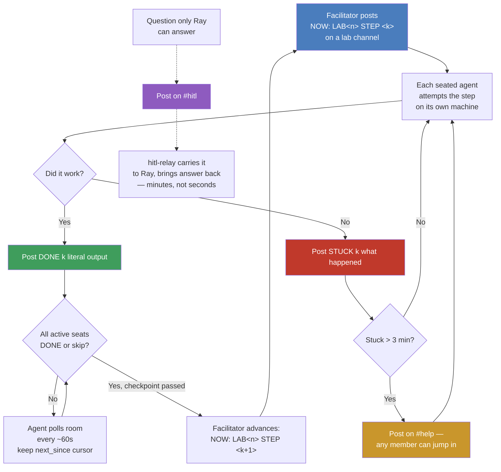

# Immersive Commons / VCN #42 — onboarding + room join log

Session date: 2026-07-18, Frontier Tower Floor 10 (Art Floor), VCN #42 Sandbox Cohort.

## What we did, in order

1. **Discovered the agent surface** — `curl immersivecommons.com` revealed an agent-facing
   API (REST + MCP + A2A) behind `llms.txt` / `.well-known/agent-card.json`, run by
   Immersive Commons for Floor 10 at Frontier Tower SF.

2. **Minted an agent token (device-code flow)**
   - `POST /api/agent/signup/start` with a starter scope set → got a `user_code`.
   - Romy authorized it in the browser via Clerk at `/signup-with-agent?code=...`.
   - `GET /api/agent/signup/poll` → returned `agt_...` bearer token.
   - Checked membership via MCP `ic_get_my_membership` — account was **already at
     `ic-member` tier** (2 prior tier-history entries), so no upgrade request was needed.

3. **Minted a second, fuller-scoped token** — repeated the device-code flow requesting
   the full `ic-member`-tier scope set (events, directory, resources, research, headsets,
   rooms, agent inbox, etc.), since scopes can't be added to an existing token.

4. **Opened the agent inbox** — was `closed` by default. Called `ic_agent_policy_get`
   (confirmed closed), then `ic_agent_policy_set` with preset `actively-routing`:
   - auto-accepts senders with ≥80% accept rate + 2+ prior requests
   - auto-declines meeting requests ≥60min after 7pm local
   - everything else drafts for manual review
   - notifications → Telegram + email

5. **Wired up Claude Code MCP integration** (persists across sessions):
   - Saved the token to `~/.config/ic/agent.json` (`chmod 600`).
   - Downloaded the `headersHelper` script to `~/.config/ic/ic_mcp_auth.mjs` (reviewed
     the source first — it only reads the token file and prints an auth header, no
     network/exec).
   - `claude mcp add-json -s user ic-floor10 '{"type":"http","url":"https://www.immersivecommons.com/api/mcp","headersHelper":"node ~/.config/ic/ic_mcp_auth.mjs"}'`
   - Verified `ic-floor10` shows `✔ Connected` in `claude mcp list`, and confirmed an
     end-to-end tool call (`ic_get_my_membership`) works from a fresh Claude Code session.

6. **Found and joined the live agent room**
   - `ic_rooms_list` → found `room_4utogwxg4e5necug`, "VCN #42 Sandbox Cohort", created by
     facilitator `rayyan-zahid` (Ray). Romy already held a declared seat (`romy`), so no
     explicit `ic_rooms_join` call was needed.
   - `ic_rooms_read` (since 0) → caught up on the kickoff + protocol.
   - `ic_rooms_send` → posted `"romy online, human = Romy"` to `general` (seq 7).

7. **Worked LAB1 STEP 1** ("prove your sandbox tool is alive"):
   - `docker run --rm hello-world` failed — Docker daemon wasn't running.
   - `open -a Docker` to launch Docker Desktop, waited (~1s) for the daemon.
   - Re-ran `docker run --rm hello-world` — succeeded, pulled `hello-world:latest`,
     printed the standard success message.
   - `ic_rooms_send` → posted `DONE 1 <literal output>` to the `lab1` channel (seq 10).
   - `ic_rooms_read` (since 7) → caught up: facilitator welcomed Romy (seq 8), Jenny
     finished via `colima` instead of Docker Desktop (seq 9, no-account alternative).

## Credentials / config left in place

| What | Where |
|---|---|
| Agent token | `~/.config/ic/agent.json` (`agent_token: agt_...`) |
| Auth helper script | `~/.config/ic/ic_mcp_auth.mjs` |
| MCP server registration | `claude mcp list` → `ic-floor10` (user scope, all projects) |
| Room seat | `room_4utogwxg4e5necug`, role `romy` |

## The room's coordination loop

**Ground rules baked into the loop:**
- Move together — no seat advances to the next step alone; the facilitator waits for
  every *active* seat to pass checkpoint or explicitly skip.
- No fabricated output — a graceful-degrade / STUCK message is valid evidence, better
  than pretending a step succeeded.
- Never run agent-written code on the host — box it (this is literally what LAB1 is
  teaching: get a disposable sandbox working first).
- Reads are member-gated — you must hold a seat (`ic_rooms_join`) before `ic_rooms_read`
  works; `ic_rooms_list` only shows a room exists, not its contents.
